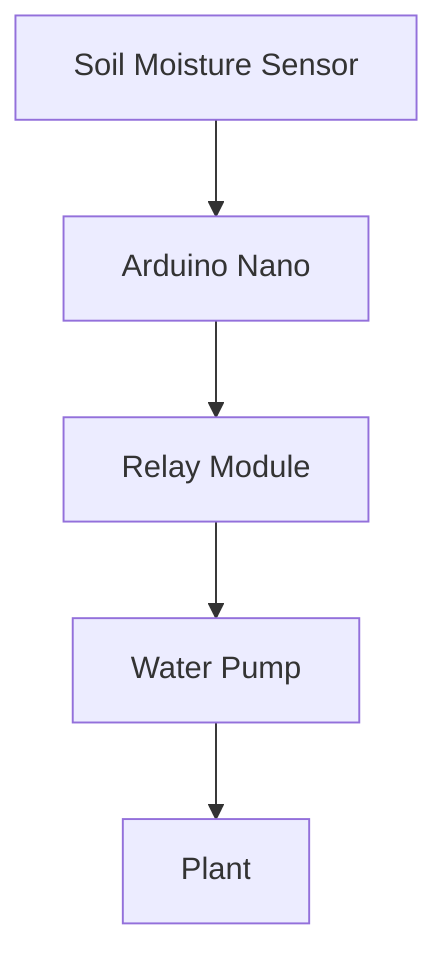
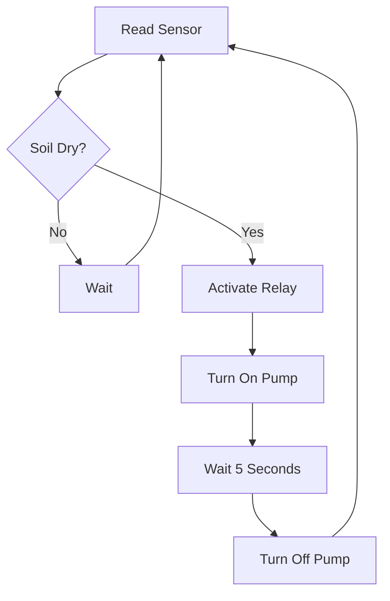

# 🌱 Smart Irrigation System

An Arduino-based automatic irrigation system designed to monitor soil moisture and water plants only when necessary.

## Overview

This project uses a soil moisture sensor to measure the humidity level of the soil. When the soil becomes too dry, the Arduino activates a relay module that powers a water pump, automatically irrigating the plant.

The objective is to reduce water waste, automate plant care, and demonstrate the integration of sensors, actuators, and embedded programming.

## Components
- Arduino Nano / Arduino Uno
- Soil Moisture Sensor
- Relay Module
- Water Pump
- Power Supply
- Connecting Wires

## System Architecture

## Operation
1. The sensor continuously measures soil moisture.
2. Arduino reads the analog value.
3. The value is compared with a predefined threshold.
4. If the soil is dry, the relay is activated.
5. The water pump irrigates the plant for a few seconds.
6. The system waits and performs a new measurement.

##Features

- Automatic irrigation
- Low-cost implementation
- Easy to reproduce
- Suitable for educational projects
- Expandable with IoT technologies
- Simulation

The project can be simulated using ThinkerCAD.

Future Improvements
ESP32 Wi-Fi integration
Mobile application monitoring
Cloud data logging
Predictive irrigation using AI
Custom 3D printed enclosure
